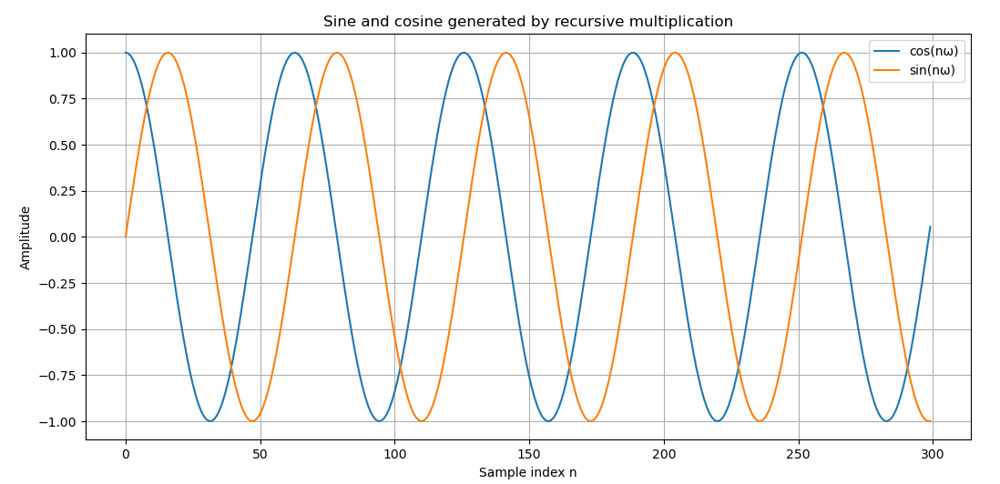
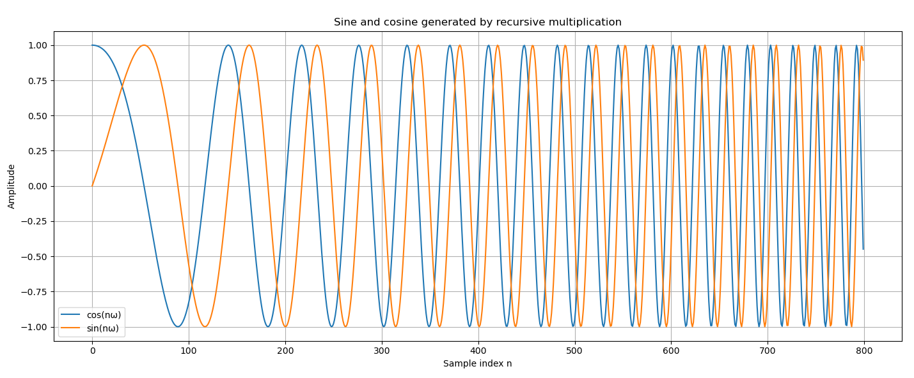

<!-- omit in toc -->
# DSP Assignment 1

<!-- omit in toc -->
### Author: Vladislav Stefanov

<!-- omit in toc -->
### Date: 09.01.2026

<!-- omit in toc -->
# Table of Contents
1. [1. Assignment: Build a sine generator in C++](#1-assignment-build-a-sine-generator-in-c)
      1. [1. Sin/Cos](#1-sincos)
      2. [2. Sweep](#2-sweep)
2. [Solution](#solution)
      1. [1. Sin/Cos](#1-sincos-1)
         1. [Explanation](#explanation)
         2. [Code Snippets](#code-snippets)
      2. [2. Sweep](#2-sweep-1)
         1. [Explanation](#explanation-1)
         2. [Code Snippets](#code-snippets-1)
3. [Results](#results)
      1. [1. Sin/Cos](#1-sincos-2)
      2. [2. Sweep](#2-sweep-2)
4. [Lessons Learnt](#lessons-learnt)

# 1. Assignment: Build a sine generator in C++
### 1. Sin/Cos
- Create a class Complex with properties re and im
- Create a method for multiplication (or overload * operator)
- Initialise two complex numbers:
    - gen = new Complex(1.0, 0.0);
    - z = new Complex(cos(0.1), sin(0.1));
- Multiply and print:
    - gen = gen * z; //print gen.re or gen.im
    - gen = gen * z; //print gen.re or gen.im
    - gen = gen * z; //print gen.re or gen.im
### 2. Sweep
Make the frequency sweep.

# Solution
### 1. Sin/Cos
#### Explanation
The program generates discrete-time sine and cosine waves using a
complex exponential recursion. 

Define a complex state g[n] by:
    
    g[0] = 1 + j0
    g[n+1] = g[n] · z

where:

    z = cos(ω) + j sin(ω) = e^{jω} (Euler’s formula)

By induction, this recursion yields:
    
    g[n] = e^{jnω}

Therefore, the real and imaginary parts of g[n] are:
    
    Re{g[n]} = cos(nω)
    Im{g[n]} = sin(nω)

Thus, each multiplication by z rotates the complex state by ω radians on the unit
circle, producing one sample of cosine and sine. The frequency is controlled by ω,
and the amplitude remains ideally constant because |z| = 1.

#### Code Snippets

Class Complex has properties re and im and and overloads the * operator to multiply two complex numbers:

    class Complex {
    public:
        double re;
        double im;

        Complex(double real, double imag) : re(real), im(imag) {}

        Complex operator*(const Complex& other) const {
            // (a + jb)(c + jd) = (ac - bd) + j(ad + bc)
            return Complex(
                re * other.re - im * other.im,
                re * other.im + im * other.re
            );
        }
    };

In main() the complex numbers g and z are initialized:

    // Constant rotator z = e^{j*ω} = cos(ω) + j.sin(ω)
    Complex z(std::cos(omega), std::sin(omega));

    // State g[n] = e^{jnω}
    Complex g(1.0, 0.0);

The basis point is g(1.0, 0.0) which is multiplied by z numerous times to generate a sin and cos waves.

    for (int n = 0; n < N; n++) {
        // Save g.re (cos) and g.im (sin) to CSV
        g = g * z;   // recursive multiplication
    }

### 2. Sweep
#### Explanation
This is an extension of the previous program in which the rotation step is time-varying resulting in a frequency sweep. The complex state g is advanced each sample by multiplication with a rotator z, but unlike the
constant-frequency case, z itself is updated at every iteration.

The initial rotator z = e^{jω₀} sets the starting angular frequency. A second complex constant w = e^{jα} is introduced, where α is the per-sample increment
of the angular frequency. By updating

    z = z · w

the angle of z increases linearly with α, so the phase increment
applied to g becomes larger at each step. Consequently, the phase of g
accelerates over time, producing a sine and cosine whose frequency increases
smoothly from ω₀ to ω₁.

#### Code Snippets

Initialization of sweep parameters and complex states:

    double omega0 = 0.02;  // start angular frequency
    double omega1 = 0.30;  // end angular frequency
    int N = 800;

    double alpha = (omega1 - omega0) / (N - 1);

    // Oscillator state
    Complex g(1.0, 0.0);

    // Initial rotator z[0] = e^{jω₀}
    Complex z(std::cos(omega0), std::sin(omega0));

    // Increment w = e^{jα}
    Complex w(std::cos(alpha), std::sin(alpha));

Recursive generation of the sweep:

    for (int n = 0; n < N; n++) {
        // Save g.re (cos) and g.im (sin) to CSV
        g = g * z;   // advance oscillator
        z = z * w;   // increase frequency
    }

This structure generates sine and cosine waves whose frequency increases smoothly
from ω₀ to ω₁ using only recursive complex multiplication.

# Results
### 1. Sin/Cos

Fig. 1. The resulting sin and cos waves

### 2. Sweep

Fig. 1. The resulting sweep

# Lessons Learnt
- Sine and cosine waves can be generated using only multiplication by working with complex numbers instead of calling sine and cosine functions directly.
- Multiplying complex numbers has a clear geometric meaning: it rotates a point around the complex plane.
- The real part of the complex number corresponds to a cosine wave, while the imaginary part corresponds to a sine wave.
- Changing parameters such as the rotation step changes the frequency of the signal, showing how mathematical values directly affect the waveform.
- Gradually changing the rotation step creates a frequency sweep, making it clear how more complex signals can be built from simple operations.
